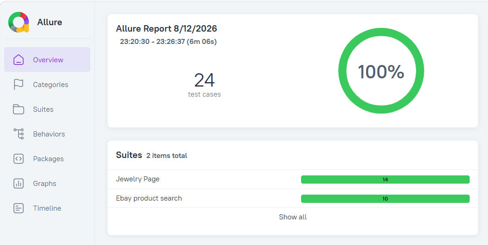
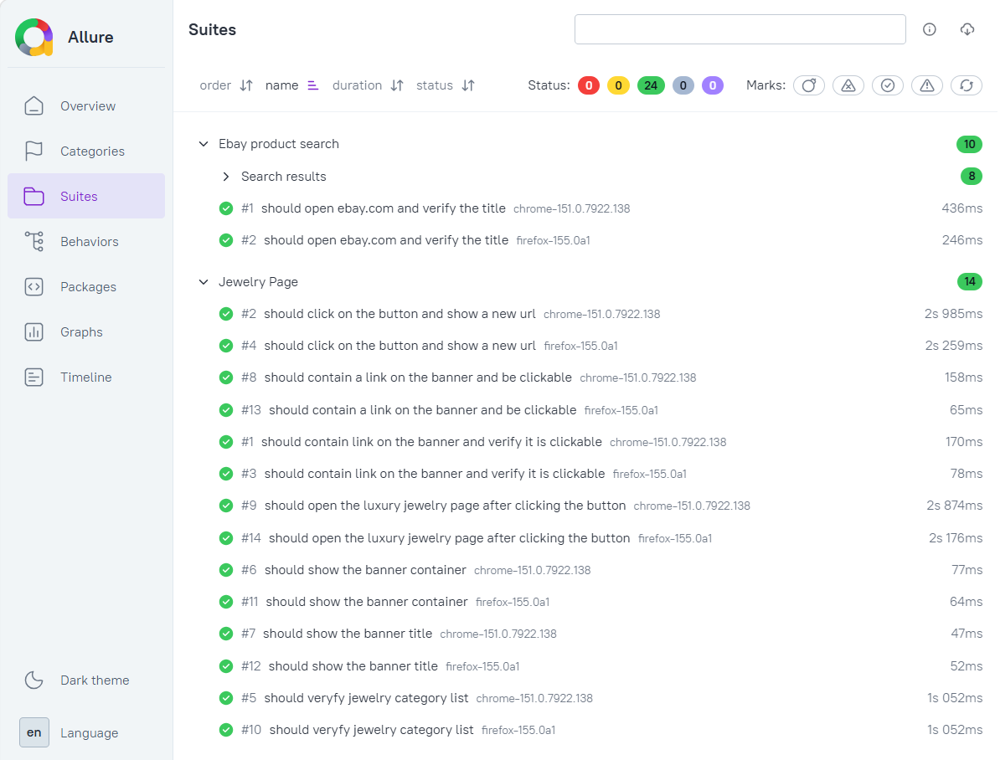
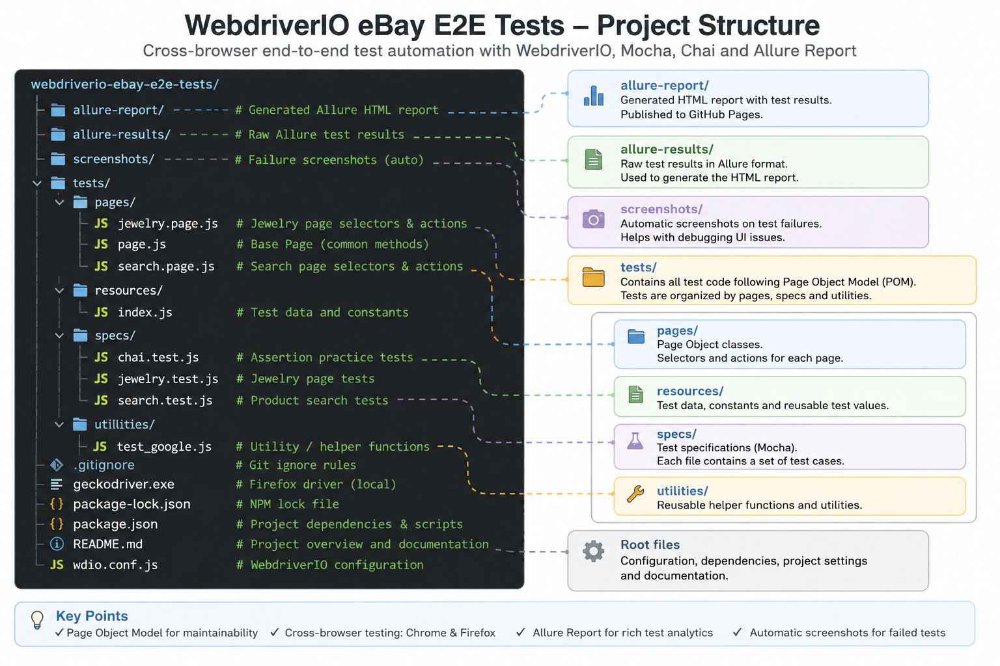
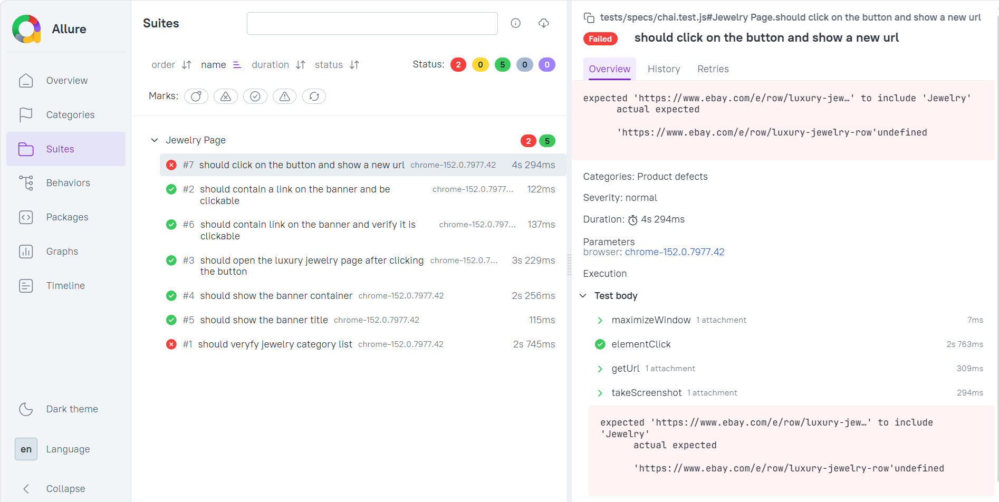

# 🧪 WebdriverIO eBay E2E Test Automation


A cross-browser end-to-end test automation project for **eBay**, built with JavaScript, WebdriverIO, Mocha, Chai, the Page Object Model, and Allure Report.

The project demonstrates maintainable UI automation against a real production website, including reusable Page Objects, optional isolated browser execution, dynamic UI handling, failure diagnostics, and interactive reporting.

## 📊 Live Test Report

### ✅ 24 test executions — 100% passed

👉 **[View Interactive Allure Report](https://pilyaria.github.io/webdriverio-ebay-e2e-tests/allure-report/)**



The report includes suite organization, browser parameters, execution timings, WebDriver steps, and test results.

---

## 🏆 Test Run Summary

| Metric          | Result           |
| --------------- | ---------------- |
| Test executions | 24               |
| Passed          | 24               |
| Success rate    | 100%             |
| Test suites     | 2                |
| Browsers        | Chrome & Firefox |
| Test type       | E2E UI           |
| Reporting       | Allure           |

## 🎯 Key Features

- End-to-end UI automation with WebdriverIO
- Cross-browser execution in Chrome and Firefox
- Page Object Model for reusable page interactions
- Browser selection through the `WDIO_BROWSER` environment variable
- Explicit waits for dynamic elements
- Automatic handling of the delayed eBay Shipping dialog
- WebdriverIO Expect and Chai assertion examples
- Automatic screenshots after failed tests
- Allure result collection and HTML reporting
- Dedicated npm scripts for isolated test execution

## 🧪 Test Coverage

### eBay Product Search

- eBay home page and title validation
- Product search submission
- Search input value verification
- Search results page title verification
- Automatic category selection for laptop and jewelry searches

### Jewelry Page

- Fine Jewelry category list validation
- Promotional banner visibility and content
- Banner link and clickability checks
- Navigation to the Luxury Jewelry page

### Assertion Practice

The project demonstrates several assertion styles:

- WebdriverIO Expect
- Chai `expect`
- Chai `assert`
- Chai `should`

### Test Suites



## 🛠 Tech Stack

| Technology         | Purpose                        |
| ------------------ | ------------------------------ |
| JavaScript         | Test implementation            |
| Node.js            | Runtime environment            |
| WebdriverIO 9      | Browser automation             |
| Mocha              | Test framework                 |
| Chai               | General-purpose assertions     |
| WebdriverIO Expect | Browser and element assertions |
| Page Object Model  | Test architecture              |
| Allure Report      | Test reporting                 |
| Chrome and Firefox | Cross-browser execution        |

## 📋 Prerequisites

- Node.js 22 or a compatible current version
- npm
- Google Chrome
- Mozilla Firefox
- Java for Allure Report generation

Verify the required tools:

```powershell
node --version
npm --version
java -version
```

## 🏗️ Project Architecture

The project follows the **Page Object Model (POM)** pattern to separate
test scenarios from page-specific selectors and actions.

Main project components:

- `tests/pages/` — Page Object classes and reusable page actions
- `tests/specs/` — automated test scenarios
- `tests/resources/` — test data and reusable values
- `tests/utilities/` — helper functions
- `wdio.conf.js` — WebdriverIO configuration
- `allure-report/` — generated interactive test report
- `reporters/` — custom reporter implementation



## ▶️ Running the Tests

Install the dependencies:

```powershell
npm install
```

Run all configured tests:

```powershell
npm test
```

```powershell
npm run wdio
```

Run one suite in both browsers:

```powershell
npm run test:chai
npm run test:jewelry
npm run test:search
```

Run a specific suite in Chrome:

```powershell
npm run test:chai:chrome
npm run test:jewelry:chrome
npm run test:search:chrome
```

Run a specific suite in Firefox:

```powershell
npm run test:chai:firefox
npm run test:jewelry:firefox
npm run test:search:firefox
```

Running one spec in one browser at a time is the most stable option because the tests interact with the public eBay production website.

## 📸 Failure Diagnostics

When a test fails, the WebdriverIO `afterTest` hook captures the current browser state. The screenshot is saved locally and included in the Allure results.

Example:

```text
screenshots/
`-- firefox_should_click_on_the_button_2026-08-12T20-51-23-531Z.png
```

Each filename contains the browser name, a filesystem-safe test name, and a timestamp. This helps diagnose dynamic content, unexpected dialogs, and temporary eBay Error Pages.

### Example of a Failed Test



## 📊 Allure Reporting

WebdriverIO writes raw test data to the `allure-results/` directory.

For a clean reporting cycle, remove results from previous executions before running the tests:

```powershell
Remove-Item -Recurse -Force allure-results -ErrorAction SilentlyContinue
```

Generate the HTML report:

```powershell
npx allure generate allure-results --clean -o allure-report
```

Open the report locally:

```powershell
npx allure open allure-report
```

> The `--clean` option replaces the generated `allure-report/` directory but does not remove old raw data from `allure-results/`. Clear `allure-results/` before a new reporting cycle to avoid mixing multiple executions.

## ⚠️ Testing a Live Production Website

This project intentionally tests the public eBay website rather than a controlled demo application. Because the application is outside the project's control:

- UI changes may require locator updates
- eBay may occasionally return temporary server or anti-bot pages
- content may differ between sessions or browsers
- parallel sessions may behave differently from isolated executions
- browser drivers may print warnings even when the final spec status is `PASSED`

These conditions provide practical experience with real-world UI automation challenges and failure analysis.

## 👩‍💻 About the Project

This project is part of my QA Automation portfolio and demonstrates hands-on experience with JavaScript UI automation, WebdriverIO, cross-browser testing, the Page Object Model, failure diagnostics, and test reporting.
